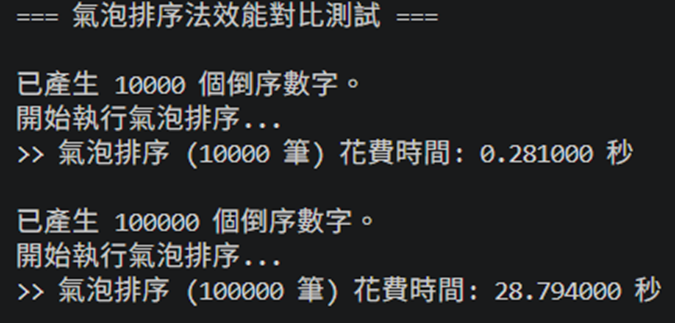
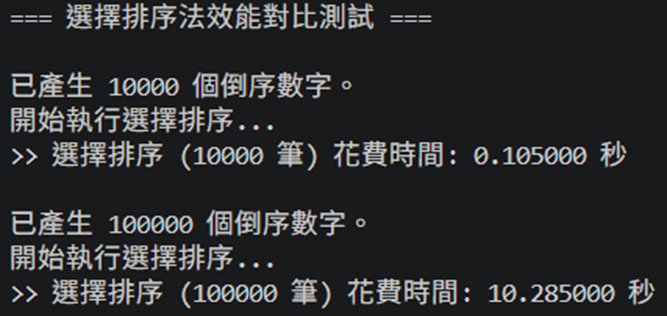
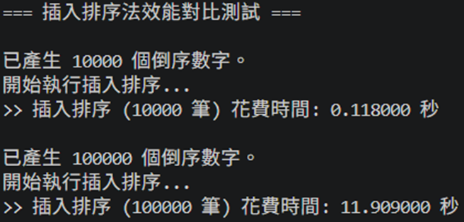
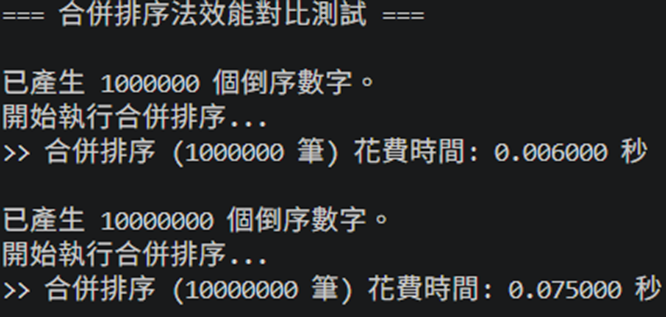
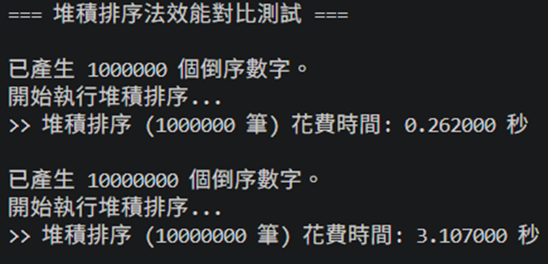

# 計概 排序報告

* **學號**：11428122
* **姓名**：林暐鈞
* **模擬頁面**：[https://jetercycu.github.io/soft_homework/](https://jetercycu.github.io/soft_homework/)

---

## 一、 氣泡排序法 (Bubble Sort)

### 1. 簡述原理
氣泡排序法是一種簡單的交換排序。一次比較兩個相鄰的元素，如果它們的順序錯誤（例如：前面的數字大於後面的數字），就將它們交換過來。這個過程會重複進行，直到不再需要交換為止。因為越大的元素會經由交換慢慢「浮」到數列的頂端（尾部），故名氣泡排序。

### 2. 複雜度分析
* **最佳時間複雜度**：O(N) （當資料已經是排序好的狀態，只需走訪一次且無交換）。
* **最壞 / 平均時間複雜度**：O(N^2)

### 3. 模擬實作內容
在測試中，我們輸入了 100,000 和 10,000 個完全倒序的整數。因為平均時間複雜度為 O(N^2) 所以當要排序的數量差 10 倍時，所花的時間是 100 倍。

---

## 二、 選擇排序法 (Selection Sort)

### 1. 簡述原理
選擇排序法的核心思想是「尋找極值」。它將數列分為「已排序」與「未排序」兩個區間。每次會從未排序區間中掃描找出最小值（或最大值），然後將它與未排序區間的第一個元素交換位置。這個過程會重複進行，直到所有元素都進入已排序區間。選擇排序對資料的初始狀態不敏感，即使給定其他排列方式，比較次數依然固定，時間增幅比例不變。

### 2. 複雜度分析
* **最佳時間複雜度**：O(N^2)（無論資料初始狀態為何，都必須執行完整掃描）。
* **最壞 / 平均時間複雜度**：O(N^2)

### 3. 模擬實作內容
在測試中，我們輸入了 100,000 和 10,000 個完全倒序的整數。因為平均時間複雜度為 O(N^2)，所以當要排序的數量差 10 倍時，所花的時間是 100 倍。

---

## 三、 插入排序法 (Insertion Sort)

### 1. 簡述原理
插入排序法的運作方式類似於整理手牌。它同樣將數列分為「已排序」和「未排序」兩部分。每次從未排序的區間取第一個元素，由後往前掃描已排序的區間，找到合適的位置後將其插入，並將較大的元素往後平移以騰出空間。

### 2. 複雜度分析
* **最佳時間複雜度**：O(N)（當資料已經是排序好的狀態，每次只需比較一次即可完成該回合）。
* **最壞 / 平均時間複雜度**：O(N^2)

### 3. 模擬實作內容
在測試中，我們輸入了 100,000 和 10,000 個完全倒序的整數。因為倒序正好是插入排序的最壞情況，平均與最壞時間複雜度皆為 O(N^2)，所以當要排序的數量差 10 倍時，所花的時間同樣是 100 倍。

---

## 四、 合併排序法 (Merge Sort)

### 1. 簡述原理
合併排序法採用「分治法 (Divide and Conquer)」策略。它會將原本的陣列不斷對半拆分，直到每個子陣列只剩下 1 個元素（視為已排序）。接著，將相鄰的兩個已排序子陣列，依序比較大小並合併成一個較大的已排序陣列，重複此動作直到全部合併完成。

### 2. 複雜度分析
* **最佳時間複雜度**：O(N log N)
* **最壞 / 平均時間複雜度**：O(N log N)

### 3. 模擬實作內容
在測試中，我們輸入了 1,000,000 和 10,000,000 個完全倒序的整數。因為平均時間複雜度為 O(N log N)，所以當要排序的數量差 10 倍時，所花的時間大約只會增加 11 到 13 倍左右，而非 100 倍。在面對巨量資料時，其執行效率擁有絕對的優勢，幾乎能瞬間完成運算。

---

## 五、 堆積排序法 (Heap Sort)

### 1. 簡述原理
堆積排序法是利用「堆積 (Heap)」這種樹狀資料結構來進行排序。首先會將未排序的數列轉換成「最大堆積 (Max-Heap)」，此時陣列的最大值會位於根節點。接著將根節點與數列最後一個元素交換（將最大值固定在尾端），並將剩餘元素重新調整為最大堆積。重複此過程直到所有元素皆排序完成。

### 2. 複雜度分析
* **最佳時間複雜度**：O(N log N)
* **最壞 / 平均時間複雜度**：O(N log N)

### 3. 模擬實作內容
在測試中，我們輸入了 100,000 和 10,000 個完全倒序的整數。與合併排序相似，因為平均時間複雜度被嚴格保證在 O(N log N)，所以當要排序的數量差 10 倍時，所花的時間同樣大約只增加 11 到 13 倍左右。不僅速度極快，且不需像合併排序那樣耗費額外的記憶體空間。

---

## 六、 綜合比較

根據我們先前的程式模擬實作與資料量倍增測試，可以得出以下三個核心結論：

### 1. O(N^2) 與 O(N log N) 的效能差
當測試資料量從 1 萬增加到 10 萬（增長 10 倍）時，氣泡、選擇、插入這類 O(N^2) 演算法的執行時間增加了約 100 倍。然而，當資料量從 100 萬筆增加到 1000 萬筆（同樣增長 10 倍）時，合併與堆積這類 O(N log N) 演算法的執行時間僅增加了約 11.5 到 13 倍。這證明了，面對巨量資料時，選擇時間複雜度較低的演算法是唯一的解決方案，硬體的效能提升無法彌補演算法層級的缺陷。

### 2. 空間與時間的衡量
在 O(N log N) 的演算法中，合併排序與堆積排序展現了不同的設計概念。
合併排序採用「空間換取時間與穩定性」的策略，它在執行過程中需要動態配置與原陣列等大（O(N)）的暫存空間；而堆積排序則是極致的「原地排序 (In-place)」，空間複雜度僅需 O(1)，即使處理一千萬筆資料，也不會佔用額外的記憶體負擔，但它輸在對 CPU 硬體架構不友善，CPU 必須不斷停下來等待主記憶體傳送資料，導致實際花費時間更長。

### 3. 資料初始狀態的影響
在最佳情況（資料已經排序好）下，氣泡排序與插入排序可以提早結束迴圈，將時間複雜度降至 O(N)。然而，選擇排序無論資料多麼整齊，都必須乖乖執行完整掃描，最佳與最壞時間皆為 O(N^2)。因此，如果已知系統中的資料有很大概率是「部分排序」的狀態，插入排序會是 O(N^2) 級別中的最佳選擇。

<h2>七、 學習心得</h2>

這次透過親自用 C 語言撰寫程式，並利用 <code>clock()</code> 函式精準測量巨量資料的執行時間，我才真正感受到演算法層級的效能差異，是現代電腦硬體再怎麼升級都無法輕易彌補的。

在模擬過程中，最讓我深刻的是資料量倍增時的指數級變化。當資料量從一萬增加到十萬時，氣泡、選擇、插入這些 O(N2) 的排序法，執行時間增了約 100 倍；然而，合併與堆積排序卻能將時間增幅控制在 12 倍左右。這讓我清楚明白，在未來軟體開發與系統設計中，面對動輒百萬、千萬筆的數據時，選擇合適的演算法才是決定系統是否能順利運作的關鍵。

此外，這次實作也讓我改變「時間複雜度相同，速度就一樣快」的思想。在測試合併排序與堆積排序時，我發現即使兩者的最壞時間複雜度都是 O(N log N)，堆積排序的實際花費時間卻明顯大於合併排序。經過進一步的研究，我了解到這與電腦底層硬體的 CPU Cache（快取記憶體命中率）有極大關聯。合併排序是連續地存取記憶體，對快取非常友善；而堆積排序在進行樹狀節點調整時，需要在陣列中大範圍跳躍，頻繁的 Cache Miss 導致了效能的折損。這個發現讓我學到，寫程式不能只看高階的演算法數學邏輯，還必須將底層的電腦系統架構納入考量。

總結來說，這次的作業讓我會更懂得如何根據資料特性、硬體資源與系統需求，綜合評估並挑選出最適合的解決方案。
